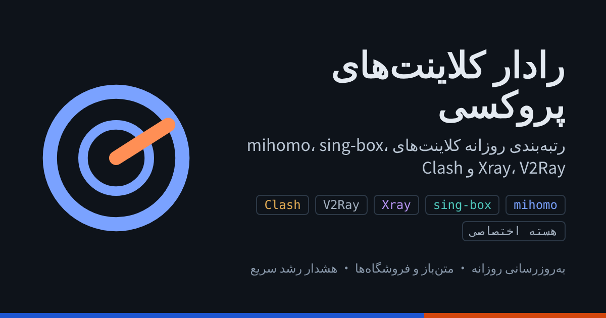

# رادار کلاینت‌های پروکسی

[简体中文](https://github.com/guiforcores/dailileida) · [繁體中文](https://github.com/guiforcores/dailileida/blob/main/README.zh-TW.md) · [English](README.md) · [Русский](README.ru.md) · **فارسی**

رتبه‌بندی روزانه کلاینت‌های پروکسی مبتنی بر هسته‌های mihomo، sing-box، Xray، V2Ray، Clash و هسته‌های اختصاصی. پروژه‌های متن‌باز با ستاره‌های GitHub و برنامه‌های فروشگاهی با تعداد امتیاز در App Store و Google Play آمریکا سنجیده می‌شوند.

**تاریخ داده: 2026-10-08** · [نسخه وب (فیلتر و مرتب‌سازی)](https://proxyclientradar.com/fa/)

## رشد سریع

- **[Bettbox](https://github.com/appshubcc/Bettbox)** · رشد بالا، تازه‌وارد — ‎+611 ستاره در ۳۰ روز (‎+15.3٪) و ‎+97 در هفتهٔ اخیر؛ کمتر از یک سال عمر دارد و از HarmonyOS و Android TV پشتیبانی می‌کند.
- **[ClashBar](https://github.com/Sitoi/ClashBar)** · رشد بالا، تازه‌وارد — ‎+191 در ۳۰ روز (‎+12.7٪)، اما در هفتهٔ اخیر فقط ‎+20؛ کلاینت نوار منوی macOS که فوریهٔ ۲۰۲۶ ساخته شد.
- **[Karing](https://github.com/KaringX/karing)** · شتاب‌گرفته — ‎+217 ستاره در هفتهٔ اخیر (حدود ۳۱ در روز)، ۲۸٪ سریع‌تر از میانگین ۳۰ روزه (حدود ۲۴ در روز).
- **[Happ](https://apps.apple.com/us/app/id6504287215)** (App Store) · رشد سریع — تعداد امتیازها در App Store آمریکا در یک روز ‎+1369 افزایش یافت و به 16545 رسید (‎+9٪)، هم‌زمان با انتشار نسخهٔ 6.0.0.
- **[sing-box MT](https://apps.apple.com/us/app/id6785326793)** (App Store) · تازه منتشرشده — کلاینت iOS مبتنی بر sing-box که ۳۱ اوت منتشر شد؛ در کمی بیش از یک ماه 119 امتیاز با میانگین 4.66.

بیشترین ستاره جدید GitHub در ۷ روز: **Clash Verge Rev** +1,300 · **FlClash** +618 · **Clash Meta for Android** +350

## کلاینت‌های متن‌باز

بر اساس نرخ رشد ۳۰ روزه

| # | کلاینت | هسته | پلتفرم | ستاره | ۷ روز | ۳۰ روز | رشد ۳۰ روزه | به‌روزرسانی |
|---:|---|---|---|---:|---:|---:|---:|---|
| 1 | [Bettbox](https://github.com/appshubcc/Bettbox) | mihomo | Windows · macOS · Linux · Android · Android TV · HarmonyOS | 3,982 | +97 | +611 | 15.3% | 2026-10-07 |
| 2 | [OneXray](https://github.com/OneXray/OneXray) | Xray | iOS · macOS · Android · Windows · Linux | 615 | +0 | +84 | 13.7% | — |
| 3 | [ClashBar](https://github.com/Sitoi/ClashBar) | mihomo | macOS | 1,500 | +20 | +191 | 12.7% | 2026-10-01 |
| 4 | [FlClash](https://github.com/chen08209/FlClash) پیشنهادی | mihomo | Android · Windows · macOS · Linux | 54.6k | +618 | +3,300 | 6.0% | 2026-10-04 |
| 5 | [Throne](https://github.com/throneproj/Throne) | sing-box | Windows · Linux | 7,377 | +66 | +374 | 5.1% | 2026-10-05 |
| 6 | [Clash Mi](https://github.com/KaringX/clashmi) | mihomo | iOS · Android · macOS · Windows · Linux | 9,672 | +65 | +488 | 5.0% | 2026-10-05 |
| 7 | [FlClashX](https://github.com/pluralplay/FlClashX) | mihomo | Android · Windows · macOS · Linux | 1,451 | +17 | +72 | 5.0% | 2026-09-02 |
| 8 | [Clash Verge Rev](https://github.com/clash-verge-rev/clash-verge-rev) پیشنهادی | mihomo | Windows · macOS · Linux | 149.6k | +1,300 | +7,200 | 4.8% | 2026-10-07 |
| 9 | [Karing](https://github.com/KaringX/karing) پیشنهادی | sing-box | iOS · Android · macOS · Windows · Linux · tvOS | 15.4k | +217 | +728 | 4.7% | — |
| 10 | [husi](https://github.com/xchacha20-poly1305/husi) | sing-box | Android | 1,822 | +11 | +74 | 4.1% | 2026-09-18 |
| 11 | [Xray (SaeedDev94)](https://github.com/SaeedDev94/Xray) | Xray | Android | 509 | +0 | +20 | 3.9% | 2026-09-16 |
| 12 | [mihoro](https://github.com/spencerwooo/mihoro) | mihomo | خط فرمان لینوکس | 312 | +0 | +12 | 3.8% | 2026-10-05 |
| 13 | [Clash Meta for Android](https://github.com/MetaCubeX/ClashMetaForAndroid) | mihomo | Android | 47.2k | +350 | +1,700 | 3.6% | 2026-10-06 |
| 14 | [Invisible Man XRay](https://github.com/InvisibleManVPN/InvisibleMan-XRayClient) | Xray | Windows · Linux | 852 | +0 | +30 | 3.5% | 2026-09-18 |
| 15 | [Amnezia VPN](https://github.com/amnezia-vpn/amnezia-client) پیشنهادی | هسته اختصاصی / Xray | Windows · macOS · Linux · Android · iOS | 15.4k | +92 | +495 | 3.2% | 2026-10-07 |
| 16 | [Koala Clash](https://github.com/coolcoala/koala-clash) | mihomo | Windows · macOS · Linux | 691 | +4 | +22 | 3.2% | 2026-08-27 |
| 17 | [OneBox](https://github.com/OneOhCloud/OneBox) | sing-box | macOS · Windows · Linux | 688 | +3 | +21 | 3.1% | 2026-09-05 |
| 18 | [YumeBox](https://github.com/YumeLira/YumeBox) | mihomo | Android | 1,002 | +7 | +27 | 2.7% | — |
| 19 | [Surfing](https://github.com/GitMetaio/Surfing) | mihomo | اندروید (روت) | 2,438 | +8 | +65 | 2.7% | 2026-10-05 |
| 20 | [Zephyr](https://github.com/Juwan-Hwang/Zephyr) | mihomo | Windows · macOS · Linux | 711 | +3 | +18 | 2.5% | 2026-09-11 |
| 21 | [ShellCrash](https://github.com/juewuy/ShellCrash) | mihomo / sing-box | روتر · خط فرمان لینوکس | 13.6k | +50 | +335 | 2.5% | 2026-10-07 |
| 22 | [v2rayNG](https://github.com/2dust/v2rayNG) پیشنهادی | Xray / V2Ray | Android | 63.6k | +276 | +1,500 | 2.4% | 2026-10-06 |
| 23 | [Exclave](https://github.com/dyhkwong/Exclave) | V2Ray | Android | 2,822 | +17 | +65 | 2.3% | 2026-10-07 |
| 24 | [Nikki](https://github.com/nikkinikki-org/OpenWrt-nikki) | mihomo | OpenWrt | 5,330 | +17 | +117 | 2.2% | 2026-10-03 |
| 25 | [NekoBox for Android](https://github.com/MatsuriDayo/NekoBoxForAndroid) | sing-box | Android | 23k | +108 | +474 | 2.1% | 2026-02-09 |
| 26 | [HomeProxy](https://github.com/immortalwrt/homeproxy) | sing-box | ImmortalWrt | 1,087 | +3 | +21 | 1.9% | 2026-09-01 |
| 27 | [Hiddify](https://github.com/hiddify/hiddify-app) پیشنهادی | sing-box | Android · iOS · Windows · macOS · Linux | 33.1k | +141 | +626 | 1.9% | 2026-10-06 |
| 28 | [clash-for-linux-install](https://github.com/nelvko/clash-for-linux-install) | mihomo | خط فرمان لینوکس | 14.9k | +24 | +279 | 1.9% | 2026-09-26 |
| 29 | [Clash Party](https://github.com/mihomo-party-org/clash-party) | mihomo | Windows · macOS · Linux | 26.7k | +75 | +493 | 1.8% | 2026-10-07 |
| 30 | [v2rayN](https://github.com/2dust/v2rayN) پیشنهادی | Xray / sing-box | Windows · macOS · Linux | 117.7k | +349 | +2,100 | 1.8% | 2026-10-06 |
| 31 | [Sparkle](https://github.com/xishang0128/sparkle) | mihomo | Windows · macOS · Linux | 7,901 | +18 | +121 | 1.5% | 2026-10-04 |
| 32 | [ClashMac](https://github.com/666OS/ClashMac) | mihomo | macOS | 6,310 | +8 | +92 | 1.5% | 2026-09-29 |
| 33 | [OpenClash](https://github.com/vernesong/OpenClash) پیشنهادی | mihomo | OpenWrt | 27.7k | +57 | +349 | 1.3% | 2026-10-06 |
| 34 | [GUI.for.SingBox](https://github.com/GUI-for-Cores/GUI.for.SingBox) | sing-box | Windows · macOS · Linux | 8,193 | +15 | +95 | 1.2% | 2026-10-05 |
| 35 | [v2rayA](https://github.com/v2rayA/v2rayA) | Xray / V2Ray | Linux · Windows · macOS | 15.7k | +28 | +172 | 1.1% | 2026-10-05 |
| 36 | [Prizrak-Box](https://github.com/legiz-ru/Prizrak-Box) | mihomo | Windows · macOS · Linux | 367 | +0 | +4 | 1.1% | 2026-09-12 |
| 37 | [ClashX Meta](https://github.com/MetaCubeX/ClashX.Meta) | mihomo | macOS | 6,278 | +12 | +61 | 1.0% | 2026-10-01 |
| 38 | [Clash Nyanpasu](https://github.com/libnyanpasu/clash-nyanpasu) | mihomo | Windows · macOS · Linux | 13.2k | +17 | +123 | 0.9% | 2026-10-07 |
| 39 | [GUI.for.Clash](https://github.com/GUI-for-Cores/GUI.for.Clash) | mihomo | Windows · macOS · Linux | 2,828 | +4 | +23 | 0.8% | 2026-09-08 |
| 40 | [PassWall](https://github.com/Openwrt-Passwall/openwrt-passwall) | Xray / sing-box | OpenWrt | 9,947 | +9 | +68 | 0.7% | 2026-10-06 |
| 41 | [Clash for Windows 改进版](https://github.com/Z-Siqi/Clash-for-Windows_Chinese) | mihomo | Windows | 28.6k | +19 | +152 | 0.5% | 2026-10-05 |
| 42 | [SimpleXray](https://github.com/lhear/SimpleXray) | Xray | Android | 343 | +0 | +1 | 0.3% | — |
| 43 | [fancyss](https://github.com/hq450/fancyss) | Xray / V2Ray / هسته اختصاصی | 华硕路由器 (AsusWRT/Merlin) | 13.8k | +0 | +35 | 0.3% | 2026-06-01 |
| 44 | [V2RayXS](https://github.com/tzmax/V2RayXS) | Xray | macOS | 1,256 | +0 | +3 | 0.2% | 2026-08-07 |
| 45 | [Outline](https://github.com/Jigsaw-Code/outline-apps) | هسته اختصاصی | Windows · macOS · Linux · Android · iOS · ChromeOS | 9,266 | +5 | +22 | 0.2% | 2026-09-21 |
| 46 | [Netch](https://github.com/netchx/netch) | هسته اختصاصی | Windows | 17.7k | +6 | +38 | 0.2% | 2026-09-12 |
| 47 | [Shadowsocks for Android](https://github.com/shadowsocks/shadowsocks-android) | هسته اختصاصی | Android | 36.8k | +13 | +71 | 0.2% | 2026-09-30 |
| 48 | [Brook](https://github.com/txthinking/brook) | هسته اختصاصی | Windows · macOS · Linux · Android · iOS · OpenWrt | 15.2k | +4 | +27 | 0.2% | 2026-09-25 |
| 49 | [V2rayU](https://github.com/yanue/V2rayU) | Xray / V2Ray | macOS | 20.2k | +2 | +27 | 0.1% | 2026-08-02 |
| 50 | [Shadowsocks for Windows](https://github.com/shadowsocks/shadowsocks-windows) | هسته اختصاصی | Windows | 59.5k | +17 | +64 | 0.1% | — |
| 51 | [ShadowsocksX-NG](https://github.com/shadowsocks/ShadowsocksX-NG) | هسته اختصاصی | macOS | 32.9k | +2 | +17 | 0.1% | — |

## برنامه‌های فروشگاهی

بر اساس نرخ رشد ۳۰ روزه، یا تا زمان کافی بودن داده بر اساس تعداد امتیاز

| # | برنامه | فروشگاه | هسته | دستگاه | قیمت | امتیاز | تعداد امتیاز | ۷ روز | به‌روزرسانی |
|---:|---|---|---|---|---|---:|---:|---:|---|
| 1 | [Happ](https://apps.apple.com/us/app/id6504287215) پیشنهادی | App Store | Xray | iPhone · iPad · Mac | رایگان | 4.64 | 16.5k | +1,369 | 2026-10-05 |
| 2 | [Streisand](https://apps.apple.com/us/app/id6450534064) | App Store | Xray | iPhone · iPad | رایگان | 4.36 | 2,099 | +49 | 2026-09-10 |
| 3 | [V2Box](https://apps.apple.com/us/app/id6446814690) پیشنهادی | App Store | Xray | iPhone · iPad · Mac | رایگان | 4.72 | 98k | +0 | 2026-08-17 |
| 4 | [Shadowrocket](https://apps.apple.com/us/app/id932747118) پیشنهادی | App Store | هسته اختصاصی | iPhone · iPad · Mac | $2.99 | 4.49 | 12.1k | +0 | 2026-09-07 |
| 5 | [Quantumult X](https://apps.apple.com/us/app/id1443988620) | App Store | هسته اختصاصی | iPhone · iPad · Mac | $9.99 | 3.80 | 1,649 | +0 | 2026-10-07 |
| 6 | [Stash](https://apps.apple.com/us/app/id1596063349) پیشنهادی | App Store | سازگار با Clash | iPhone · iPad | $5.99 | 4.36 | 1,235 | +0 | 2026-07-16 |
| 7 | [Surge 5](https://apps.apple.com/us/app/id1442620678) | App Store | هسته اختصاصی | iPhone · iPad | رایگان + اشتراک | 4.09 | 993 | +0 | 2026-09-13 |
| 8 | [Hiddify](https://apps.apple.com/us/app/id6596777532) | App Store | sing-box | iPhone · iPad | رایگان | 4.46 | 811 | +0 | 2026-02-19 |
| 9 | [Karing](https://apps.apple.com/us/app/id6472431552) پیشنهادی | App Store | sing-box | iPhone · iPad · Mac | رایگان | 4.61 | 682 | +0 | 2026-09-11 |
| 10 | [Loon](https://apps.apple.com/us/app/id1373567447) | App Store | هسته اختصاصی | iPhone · iPad | $7.99 | 3.94 | 500 | +0 | 2026-06-25 |
| 11 | [Clash Mi](https://apps.apple.com/us/app/id6744321968) پیشنهادی | App Store | mihomo | iPhone · iPad | رایگان | 4.65 | 423 | +0 | 2026-09-02 |
| 12 | [incy](https://apps.apple.com/us/app/id6756943388) | App Store | Xray | iPhone · iPad | رایگان | 3.81 | 276 | +0 | 2026-09-21 |
| 13 | [sing-box MT](https://apps.apple.com/us/app/id6785326793) پیشنهادی | App Store | sing-box | iPhone · iPad · Apple TV | رایگان | 4.66 | 119 | +0 | 2026-09-24 |
| 14 | [Egern](https://apps.apple.com/us/app/id1616105820) | App Store | هسته اختصاصی | iPhone · iPad | رایگان | 4.20 | 85 | +0 | 2026-07-23 |
| 15 | [Anywhere Proxy](https://apps.apple.com/us/app/id6758235178) | App Store | هسته اختصاصی | iPhone · iPad · Apple Watch · Apple TV | رایگان | 4.74 | 54 | +0 | 2026-09-29 |
| 16 | [FoXray](https://apps.apple.com/us/app/id6448898396) | App Store | Xray | iPhone · iPad · Mac | رایگان | 3.90 | 42 | — | — |
| 17 | [RabbitHole](https://apps.apple.com/us/app/id6683309629) | App Store | mihomo | iPhone · iPad · Mac | رایگان | 3.95 | 20 | +0 | 2026-07-28 |
| 18 | [Surfboard](https://play.google.com/store/apps/details?id=com.getsurfboard) | Google Play | هسته اختصاصی | Android | رایگان | — | — | — | 2026-07-07 |

## توقف توسعه

دیگر نگهداری نمی‌شوند (بیشترشان با توقف هسته اصلی Clash در نوامبر ۲۰۲۳ متوقف شدند)؛ صرفاً برای مرجع: Clash for Android، Clash for Windows، [Clash Verge](https://github.com/zzzgydi/clash-verge)، [clashN](https://github.com/2dust/clashN)، ClashX Pro، ClashX، [Qv2ray](https://github.com/Qv2ray/Qv2ray)

---

برچسب‌ها: رشد بالا = دست‌کم ۱۵۰ ستاره جدید در ۳۰ روز و دست‌کم ۸٪ کل؛ شتاب‌گرفته = دست‌کم ۱۰۰ ستاره جدید در ۷ روز و نرخ روزانه ۷ روزه دست‌کم ۱٫۲۵ برابر نرخ ۳۰ روزه؛ تازه‌وارد = کمتر از یک سال عمر و دست‌کم ۱۵۰ ستاره در ۳۰ روز؛ تازه منتشرشده = کمتر از ۱۸۰ روز در فروشگاه.

منابع: GitHub، gittrend.io، App Store و Google Play آمریکا. هر روز حدود ساعت ۹ صبح (UTC+8) به‌طور خودکار به‌روز می‌شود.

